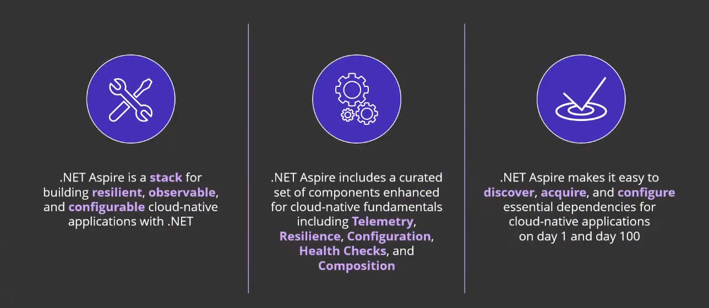

---
tags:
  - Conference
  - dotnet
  - Cloud
  - Aspire
---
[Previous Session](Full%20stack%20web%20UI%20with%20Blazor%20in%20.NET%208.md) - [Next Up](Performance%20Improvements%20in%20.NET%208,%20ASP.NET%20Core,%20and%20.NET%20MAUI.md) - [.NET Conf 2023 Parent Page](README.md)

---
_Speakers: 
Glenn Condron - Principal Program Manager, Microsoft
& David Fowler - Distinguished .NET Engineer, Microsoft_
[Link to vod](https://www.youtube.com/watch?v=z1M-7Bms1Jg)

>[!note]+ Summary
>Aspire is basically the future for Cloud Native .NET applications. In the AppHost you register the applications that should be in the Aspire Orchestration and be run together. And with the ServiceDefaults you get access to a bunch of Cloud Services, like Redis, configured with defaults that gets you going faster. Everything is customizable and in C# which gives you help with intellisense etc.

Most of this session is going to be demos, so watching the vod is probably going to be more helpful. But I will try to note some things.
# .NET Cloud Native
.NET has had a goal for a long time to be a good option for Cloud Native applications. Aspire is the main thing that will bring these together and do even more.

Common feedback from customers who want to build cloud native applications include:
- "There's just too much choice on the market, which service do I pick, which is the best? Do these blocks even fit each other?"
- Developers need to become expert in cloud topics. Developers gets an even higher workload
- Nothing works together by default

At the beginning of .NET 8 the team took a tour of what teams at Microsoft are doing when they're building Cloud Native, 
You're either using libraries to fill gaps or you use wrapper libraries to make it fit in to what you need. 

Even with all the information gathered, distributed applications are just hard. Aspire tries to fix this.

_Aspire Overview_

# Demos
The eShop demo application was built using Aspire.

There are two templates now, an empty template and a starter application. The starter application comes with a Blazor frontend, an API-backend and a Redis Cache. 

You can also just create whatever application and then add in Aspire. You also get an option during creation of a project "Enlist in Aspire Orchestration" and get it that way. The demo is David mostly showing how easy it is to get Aspire into it. He starts by creating a Blazor application and not enlisting Aspire, just to show how easy it is. He then creates a standard WebApi to have a backend. Still no Aspire, just having a standard backend-frontend situation.

A problem they highlight is when you want to go and register the HTTP client you need to have a base URL, so you go over to the API and open the settings, you get 4 URLs just staring you down, this is a complexity that slows people down and make people not want to do this. And this also just works locally, not when you deploy. So you need to create a schema in config to make it work etc.. This is one of the first things that Aspire helps out with.
## Adding in Aspire
To add Aspire to an existing Solution you 

	rightclick a project -> add -> .NET Aspire Orchestrator Support. 

The reason it's not on the solution is because the project you clicked on will be automatically added to the Orchestrator.
### What Aspire Adds
When you accept the modal to add Aspire you get 2 new projects in the solution. 1 is the AppHost and 1 is the ServiceDefaults.

In the AppHost we tell the orchestrator what it is we want to run, it's here you set up what projects you want to be part of your distributed system. 

We could type out adding all the support for the other projects in our solution, or we can go through the same right click procedure. It will see that there's already an AppHost created and not create a new one but just update and add in the new project to that.

You can capture the adding to the builder in a variable, and use that as a reference for other projects. David captures adding the backend into an API variable, and uses that to add a reference to the frontend. Using the WithReference extension method. Which sets up the connection between frontend and backend for us. And you can the directly in your frontend reference the URL, same as the name we gave it in the AppHost, and not reference any ports.
# Running Aspire
We just set up Aspire as the launch project, no need to have multiple projects or whatever. It will prompt you to start Docker if you want. But Docker is not required. Docker is only required to be launched if you're actually using Docker. 

The starter Application is using Redis with a container, and then you will have to use Docker.

As mentioned in the keynote, running the AppHost will launch the dashboard and all the applications needed. 
## Dashboard
In the dashboard we see what endpoints we have, we see the state, and if there's any crashes of any of the applications. We can also go in and read the console logs of specific applications. We can also read traces and more. The trace is End-to-end and you can track a request across the entire distributed system. 
# Service Defaults
ServiceDefaults is where the defaults are setup for the different services, which gives you a out of the box experience that suits many but not everyone. These are configurable to what you needs is. 

Many of the components are individually developed and not tied to Aspire, they push the fact that Aspire is a stack that collects a bunch of good independent things together.

With ConfigureHttpClientDefaults you can define standards that will apply to every HttpClient that gets created, and with the standard AddStandardResilienceHandler you get a Polly setup with a default policy determined by the Aspire team, which you of course can configure if you want/need to. The UserServiceScanning method is what allows us to be able to use the name of the service as mentioned above. Where the name of the project in AppHost is the same as the URL we use for BaseURL in HttpClient.

The plan is that you as a developer do the same interactions with the services, but there's magic around it that makes it work. 
# Packages
When you right click you have the option to add orchestrator support as mentioned before. There's also an option to add an Aspire Component, which is a specific NuGet package that is packaged by the Aspire team. It's basically a wrapper package for community services that gives you all what you need to give you the experience that you want.

It's possible to unpack and see what the packages is actually doing. Reading what the defaults are and such.