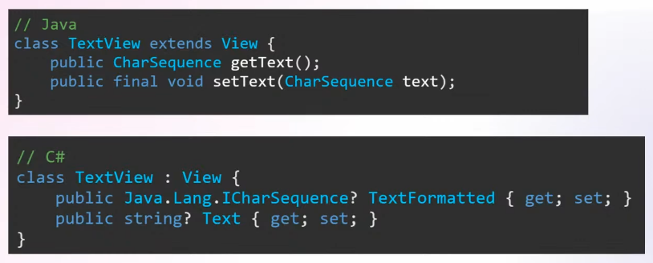
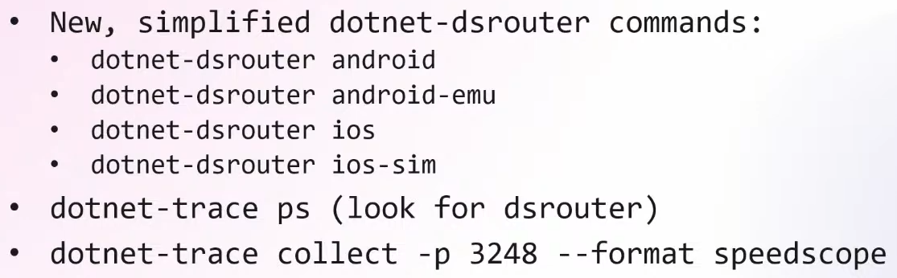
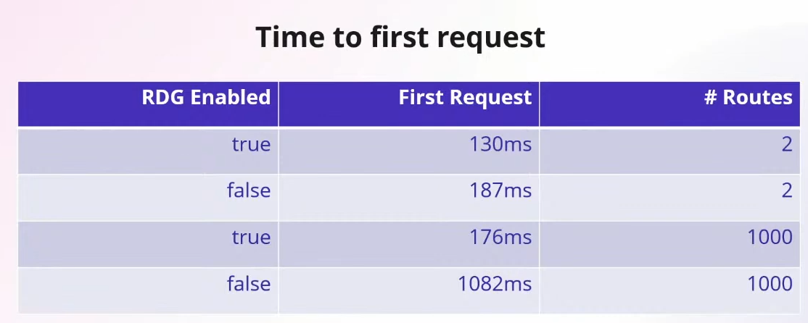
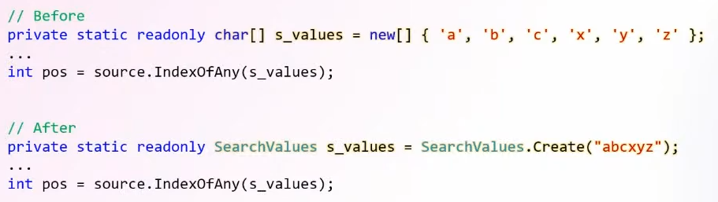

---
tags:
  - Conference
  - dotnet
  - Performance
  - ASP-NET
  - MAUI
---
[Previous Session](Building%20Cloud%20Native%20apps%20with%20.NET%208.md) - [Next Up](What's%20new%20in%20Csharp%2012.md) - [.NET Conf 2023 Parent Page](README.md)

---
_Speakers:
David Fowler - Distinguished .NET Engineer, Microsoft
& Stephen Toub - Partner Software Engineer, Microsoft 
& Jonathan Peppers - Principal Software Engineer, Microsoft._
 
Note: Stephen Toub is the author of the [Performance Improvements in .NET 8](https://devblogs.microsoft.com/dotnet/performance-improvements-in-net-8/) article, and previous versions articles. 

[Link to vod](https://www.youtube.com/watch?v=YiOkz1x2qaE)

>[!note]+ Summary
>As always with performance improvements there's many small things adding up to be big updates. The best way to make your application more performant is to simply update your application to .NET 8. 
>Each and every one of the topics here are also in blogs that each team posts, not only the Performance blog by Stephen Toub.

# MAUI
_Jonathan's part_
[Blog post about performance improvements in MAUI](https://aka.ms/mauiperf8)
Focus on fundementals and quality. Performance wasn't top focus. It was more focused on squashing bug, but still be better than .NET 7. 

On Android there was a focus on Startup time. and there's a slight improvement across the board.

For iOS the focus is about app size instead of startup time. There was an experiment to build Native AOT on iOS. And the app size becomes way faster. You're no longer using mono as a runtime. Native AOT on iOS have faster startup time and smaller memory footprints.

In the future/NET 9 they want to experiment with the trimability and moving to Android.
## Memory Leaks
[Blog Post](https://aka.ms/maui-memory-leaks) 
The Roslyn analyzer will catch iOS circular references that lead to memory leaks. Many .NET developers are not knowledgeable about memory leaks and memory management so the analyzer will help them. They ran that in the MAUI codebase to try and catch as many as possible. 
## Improvements in Java Interop

This interaction has been cleaned up, and it no longer allocates to the heap but instead the interaction is allocating an object to the stack which gets disposed. Oversimplified, yes, but that's the gist. This will basically affect all the Labels etc. in MAUI projects since they call into this. Like many things in performance it's the small things adding up. 
## Profiling
_**dotnet-trace, dotnet-gcdump**_
There are now new easy to use commands to get information about the application dumped out. Uses [dsrouter](https://learn.microsoft.com/en-us/dotnet/core/diagnostics/dotnet-dsrouter), and it's now a simplified use-flow. No more forwarding ports etc.

[Wiki post to helpout](https://aka.ms/profile-maui) - it's still tricky so this helps out to profile a .NET MAUI application on mobile.
# ASP.NET
_David's part_
[Blog Post](https://devblogs.microsoft.com/dotnet/performance-improvements-in-aspnet-core-8/) - [Benchmarks](https://aka.ms/aspnet/benchmarks)

A lot of the low hanging fruits have been discovered or handled so they're really getting into more nitty-gritty parts of the code that can be improved and it's kind of impressive that they're still able to do it.

.NET 8 has about a 24% improvement compared to .NET 7 when it comes to requests per second. .NET puts a lot of work to get their benchmarks faster, and making the benchmarks being fair. But of course benchmarks are benchmarks and should be taken with a grain of salt. 
## Server improvements - Kestrel
Header parsing has been improved. Headers are one of the first things that's processed by a server. And it's now removed allocations, and it's optimized using SequenceReader. This leads to an 18% performance improvement. This was something that was determined to be an edge-case before, but then they saw this popping up in a bunch of benchmarks.

Reduced byte\[ ] allocation from 7.8GB to 2GB in benchmarks scenarios. Which is a 73% gain.

They now check if it's a small header and if it is they just allocate it on the stack. If it's longer they rent it from a shared array pool. Which leads you to not allocate for the majority cases. Typically the header is not big.
## Server improvements - HTTP.sys
There's more servers than Kestrel. These others are mostly used by internal teams that are Windows based. It's not a primary focus and you should still use Kestrel. It's sort of introducing changes that are already in Kestrel. But the changes lead to big updates. 

Improved performance of request headers, that was low hanging fruit because there was some wild LINQ statements that have been cleaned up and no longer allocating memory. This also affected AJAX.
## Native AOT
Reduces size on disk, since what's not used is trimmed off. For this to work there's a subset of the framework that's trim-friendly. 

Improves startup times, by making things pay for play. 

Lower the memory footprint, by allocating less and improving the GC. 

David refers to [Tiny, fast ASP.NET Core APIs with native AOT](../Day%202/Tiny,%20fast%20ASP.NET%20Core%20APIs%20with%20native%20AOT.md) for more information about how Native AOT does what it does.
### Really minimal API
The dependency graph used to be huge for a standard webapplication builder. Because it pulls in things like authorization etc. It all adds up in the end. The new CreateEmptyBuilder is the most scaled off, not usable out of the box, version of a minimal application. It doesn't even have a server. But the point is also to show how far they got in the trimming. The empty builder together with Kestrel comes out to 15MB.

With AOT every dependency matters
## Request Delegate Generator (RDG)
Minimal APIs is not trimmer and native AOT friendly, because there's a heavy usage of code generation to optimize throughput. It got a high startup time because it compiles endpoints at runtime. 

The solution to this is the source generator, RDG. It replaces all the things like MapGet, MapPost etc. with AOT and trim friendly code. This moves a lot of the work from startup to compilation. 

Basically we see a massive improvement the better the application gets.
# Runtime Performance
_Stephens part_
Stephen is very good at explaining performance for someone with little to no understanding of the concepts he is talking about.

As mentioned above Stephen writes a massive blog post about all the updates.
## Dynamic PGO
By far Stephens favourite improvement. And has a good chance of being the biggest improvement for upgraded applications, coming from earlier .NET versions. It's been part of .NET since .NET 6 but it has been turned off by default until now. And it has been slowly upgraded over the versions. 

Dynamic PGO relies on Tiered Compilation, where the JIT (Just In Time Compiler) recompiles methods. On the first compile it does no optimization, it just compiles something that works, this very fast to do. And not optimizing doesn't matter because the majority of methods are only invoked once. The runtime then keeps track of how many times a method is invoked, and when a threshold is met the JIT comes back in and recompiles the code with optimizations this time. This gives you great startup and great throughput. 
There is a bunch of things that the JIT can learn from the first compile without optimization, Tier 0/T0.

**For example**:
Making virtual calls or interface calls is less efficient than making a direct call. This means that while T0 is doing those interface calls the runtime keeps tracks of the types it's using, and can say what type it most likely is. And in T1, the recompilation, we can check if it is that type and then do a direct call.

The JIT does this by first compiling to T0, then when it notices that a specific method is getting invoked a lot it recompiles it again, but not to T1 but to an instrumented T0. This version has the instruments needed to see where the hot-paths is and what it is doing, basically getting information in order to improve the next compilation. Then it goes and compiles to T1 taking advantage of the information gathered.
## JSON Fast Paths
System.Text.Json has a lot of improvements in .NET 8. 

Previously the runtime had to do a lot of work to serialize and deserialize types. It used to do this via reflection. It now instead does the analysis at build time and emit code at build-time to save work at runtime. It can also get information about Fast Paths, which can create very specialized workflows. But this hasn't worked for streaming or async. Until now where they work everywhere, increasing performance everywhere.

This is dramatically faster and smaller in footprint.
## Search Values
Json Fast Paths  is one of those if you just upgrade your version you get a better, faster, more performant application. There are also updates where by updating you get access to new primatives that are better suited for certain work and they're more performant for the work they do. And SearchValues is one of these latter ones. It allows you to efficiently search for an arbitrary size of bytes and chars. This replaces IndexOfMany, which is only optimized for small sizes of bytes and chars.

This is now used throughout the libraries and ASP.NET. And it can improve a lot of throughput. 