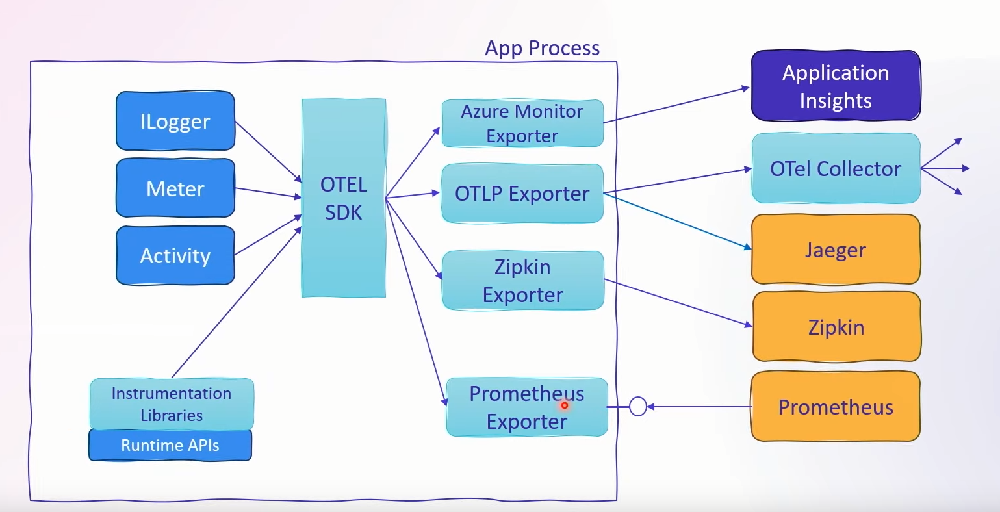

---
tags:
  - Conference
  - dotnet
  - Telemetry
---
[Previous Session - End of day 1](../Day%201/What's%20New%20in%20.NET%20MAUI.md) - [Next Up](Building%20resilient%20cloud%20services%20with%20.NET%208.md) - [.NET Conf 2023 Parent Page](../README.md)

---
_Speakers:
Noah Falk - Principal Software Engineer .NET Runtime, Microsoft
Sam Spencer - Product Manager, Microsoft
[Link to vod](https://www.youtube.com/watch?v=BnjHArsYGLM)

>[!note]
>### Summary
>New support stronger support for metrics and logging in .NET 8. Encouraging you to build your logs in a more performant way and not using the quick and dirty extension methods on ILogger. The ILogger extension methods do not scale well with high frequency applications. 
>Metrics are now built into ASP.NET and they're super simple to use with DI thanks to IMeterFactory. 

# What's new in .NET 8?
Built-in metrics using Meter API
Telemetry API improvements
Telemetry is a foundational feature of Aspire. Based on OpenTelemetry and visualization in the dashboard.
# What is OpenTelemetry?
Up until a few years ago if you wanted to have monitoring you would have to pick one of the APM vendors and go with theirs. But this locked you into to a vendor, and it was also a problem for the library ecosystem since they were also locked. OpenTelemetry(OT) was the solution to this and it sits as a middleware between the application and the monitoring platform. OpenTelemetry is a platform agnostic Observability & Telemetry Platform.
It supports logs, metrics and distributed tracing. It's open source, and it's supported by all major Application Performance Monitoring(APM) vendors.

There was recently a sign off on a semantic schema for telemetry so that different languages output same structured telemetry. Which makes them coexist easily.

There's a wire protocol called OTLP. This defines how data is structured and transmitted between different components of the OT framework. It ensures that information about traces, metrics and other observability data can be efficiently and accurately sent from application to observability backend.


ILogger, Meter, Activity are the three pillars of telemetry that the .NET platform has defined methods for and we use in our applications. These then talk to the OTEL SDK which exports it out with explicit exporters for different backends. Like if we want our data to end up in Application Insights we use the Azure Monitor Exporter.

## Prometheus note
All the exporters use a push model, they push data to their platform. Except for Prometheus. Prometheus is using a pull model which requires us to define and endpoint in our API for prometheus to scrape. we do this in our Program.cs by adding:

	app.MapPrometheusScrapingEndpoint();
# Demo
It's mostly adding a few nuget packages including an exporter to get going. 
In our Program.cs we say that we want to add OpenTelemetry to our services. We can then add on that we want to add metrics. which is just an extension method. Within the configuration of metrics we add the meters. Meters are just the category of metric we want to define, and these requires a string name. New to .NET 8 is that we have the "Microsoft.AspNetCore.Hosting", "Microsoft.AspNetCore.Server.Kestrel", "System.Net.Http" meters. This together gives us the inbound and outbound traffic metrics. 

We also need to add the exporter to the configuration. So it knows where to export it's data.

The Aspire dashboard is using the OtlpExporter. 

If we want logs to be exported we do that by accessing 

	builder.Logging.AddOpenTelemetry(...)

Where the dots in the parenthesis represents the configuration, which is basically just defining our exporter. But you can probably do a lot of fun things there.
# Logging with ILogger
ILogger works as an abstraction over multiple log sources. The sources you want to use is defined in code, and it' automatically there for ASP.NET applications. There's multiple providers including console logging and OTel.

Through configs you can say what gets sent to what provider.
## Logging API Progression
### Quick and Dirty
The fastest and easiest way to log, and also the way that's not recommended is using the extension methods off of ILogger, LogInformation, LogWarning, LogError, LogTrace, LogDebug
```C#
myLog.LogInformation("{count} items have been added to the cart", cart.items.Length);
```

Parameters are separate from the message string, and they need to be boxed which allocates memory. This is simple to use but it's sub-optimal in high frequency applications. There's no stable Id on the logging. 
### Step up
Instead of the quick and dirty version we can use LoggerMessage.Define, which automatically creates a delegate to be used. The perks are basically solving the issues with the previous method. The type is strongly typed so it's no longer boxed, message is parsed once for parameters. And the event has a static Id. 

This is also problematic because it's ugly as heck.
### .NET 6 Code Gen
With .NET 6 we could add an attribute to methods we wanted to log, which in turn generates similar code to the LoggerMessage.Define method. This gives us cleaner syntax, but the method has to e partial. This is what they want us to use if we do logging.
### .NET 8 Improvements
They still want us to use the code gen version but in .NET 8 they introduced some updates. You can now use a custom object as part of an individual parameter. You do this by using the \[LogProperties] on a parameter. It will go in and take all the public properties and log them, if you want to ignore properties you can use \[LogPropertyIgnore] sort of like serializing. You can use a \[TagProvider] to point to a method for selecting which properties of a complex object should be logged.

There's now IEnumerable and dictionary support and these will be logged automatically. Including all the members. 
## Lessons from MS internal teams
New features that include redaction based on Data classification attributes. They introduce policies for redacting information from logs, can be for example region based. 

Enrichment, augments existing logging messages with extra tags. Which will append to every log message. 

Fakes, which are helpful for Unit testing, it's a component that acts as a ILogger provider, so in your tests you can use the fake one instead. And it collects all the things that should've been logged and you can ensure that it is what you want it to be. 
# Metrics
System.Diagnostics.Metrics API supports instruments such as Counter, Gauge, Histogram, observable variants. Key/value tags can be used to add dimensions to metrics. 

Metrics are observed via OpenTelemetry.
## New to .NET 8
There are built in metrics for ASP.NET Core & HttpClient. We get IMeterFactory, and there's also a fake for testing purposes. This last one is under:

	Microsoft.Extensions.Diagnostics.Metrics.Testing.MetricCollector
### IMeterFactory
Previously there was an issue where ASP.NET is heavily DI focused, and metrics didn't support DI well at all. So they created IMeterFactory, which can get injected to constructors. This can then get used to create things like counters, for example used with counting how many processed orders.
## Demo
They create a separate class for the metrics, where we define all the metrics we want for the associated application. In there they inject the IMeterFactory and wire it up with counters for what they need. This new metrics-class is then registered as a singleton in the DI container in Program.cs. And it's then added to the metrics configuration that was mentioned earlier. With the same name as the meter got when it was created from the IMeterFactory. 

To actually get it to increment the counter though we need to Inject the metrics class (not the factory) where we do the thing we want to measure, In their example the controller. There he increments the counter by using the Add extension method. And he also adds two dimensions of Key Value pairs, but that's up to the use case. 
# Resources
[.NET OpenTelemetry Repo](https://github.com/open-telemetry/opentelemetry-dotnet)
[Open Telemetry on NuGet](https://www.nuget.org/profiles/OpenTelemetry)
[Grafana Dashboard](https://github.com/dotnet/aspire/tree/main/src/Grafana)
[Microsoft Learn for Grafana & Prometheus](https://learn.microsoft.com/en-us/dotnet/core/diagnostics/metrics-collection#view-metrics-in-grafana-with-opentelemetry-and-prometheus)
