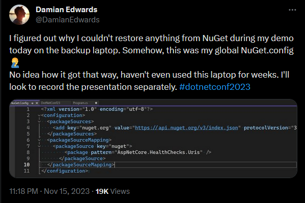

---
tags:
  - Conference
  - dotnet
  - ASP-NET
  - Native-AOT
---
[Previous Session](What's%20new%20in%20System.Text.Json.md) - [Next Up](Visual%20Studio%20Updates%20for%20.NET%20Devs.md) - [.NET Conf 2023 Parent Page](README.md)

---
_Speaker: Damian Edwards - Principal Architect, Microsoft_
[Link to vod]()

>[!note]+ Summary
>Native AOT is made for cloud-centric API workloads. It uses a pair of 2 new `WebApplication` builders to slim the application down. By publishing in AOT we lose some things like the JIT, but we gain other things as much decreased start up time, and much decreased file size. There are some limitations to which APIs are available for an AOT application due to them needing to be trimmable. But this is always expanding too. So AOT is there for cloud-centric workloads, where you can fit more of them into a cluster than with regular applications, it's really a question if the optimization is worth it for your application.

>[!warning]+ Note
>This session's demo had big issues due to a bug in Damian's VisualStudio. He talked about re-recording parts , and I might come back to those parts then. But he did talk it through instead of showing things. And his demos seem to mostly be proving that it works.
>

# Why Native AOT?
- Smaller Apps
- Faster startup
- Less memory use

This release has a lot of Cloud centric thinking behind it, and these things all help out when you're building for the cloud. One of the things it helps with is you can place a bunch more instances in a given cluster if they're smaller. There's also the issue of cold-starts, with Native AOT you have a much shorter startup which decreases the effects that cold-starts have on the application and end-user experience. 

Especially when you compared ASP.NET previously ASP.NET fell behind and was something that had to be improved.
# How does Native AOT work?
C# is compiled to IL(Intermediate Language) on build. Then when you go to publish your application, in order to deploy, the IL is compiled over to platform code, (e.g. x64). The published AOT application doesn't have a JIT. It still contains a runtime & a GC, they're still management going on. It's a single file, and it's been trimmed to reduce the app size. Native AOT is OS & architecture specific e.g. linux-x64.
# Impact of no JIT
You lose the runtime code generation, e.g. no Dynamic PGO. There's static PGO and you get the compiler seeing all of the application at compile time.

No `Assembly.LoadFile` - this isn't possible because the assemblies would be IL and then JIT into ML and that's not possible without JIT.

No Expression compilation, instead there's an interpreter but you see a performance loss. 

No `Reflection.Emit`, which is a popular way to do high performance source gen. But that relies on JIT so no go.
# Impact of trimming
Unreferenced code (no callers) is removed. The app is analyzed and if it thinks something is not referenced it gets trimmed. You can't scan assemblies or types since they don't exist. The opposite can also happen where due to coding patterns the the analyzer can't determine if the code is unreferenced or not.
# Builders
In order to get to a as small as possible version of the WebApplication there was a new version of the builder created. The `CreateSlimBuilder`, this makes some opinionated decisions about what to keep and what to remove to be able to make the end application as small as possible. If you want something even smaller you can go with the `CreateEmptyBuilder`, and this is as small as it is possible to get. It doesn't take args because that would mean that it uses args and it doesn't. It doesn't come with a webserver out of the box and it has to be added in. `builder.WebHost.Kestrel();` And if that is still too much for you, you can go in and use `builder.WebHost.KestrelCore();` which is a kestrel server without any defaults, it forces you as a developer to decide what to put in. Many times you can find a core version of services which comes without defaults.

Running the `EmptyBuilder` you don't get our nice defaults such as logging, reading from environmental variables, or configuration managers. And these are things that the AOT team at Microsoft things are reasonable to have still so they add those into the `SlimBuilder`.
# Other considerations
Requires extra build-time pre-requisites 
- Visual Studio C++ tools on Windows
- Clang on Linux
- XCode on macOS

You can't publish cross-platform. You need to be on the platform that you want to publish to. So if you want to publish to Linux you need to be on Linux. Docker build might be a way to get around this. Or by using WSL if you're on windows.
# ASP.NET Core Native AOT support
The initial target of native AOT is cloud-focused/cloud native API workloads. This means we have
- Kestrel HTTP server
- Middleware
- Minimal APIs (Request Delegate Generator)
- gRPC
- JWT Authentication
- Authorization

But we don't have MVC/Web API, Razor/Blazor, or SignalR. But these are things that might get added in the future.
## Data access
For data access ADO.NET is native AOT ready. And there are supported providers for PostgreSQL (`Npgsql`) and SQLite(`Microsoft.Data.Sqlite`).

The supported ORMs are `Dapper.AOT` (which just got released.) and [Nanorm](https://github.com/DamianEdwards/Nanorm). EF Core is not supported yet but they want to release that maybe for .NET 9.
