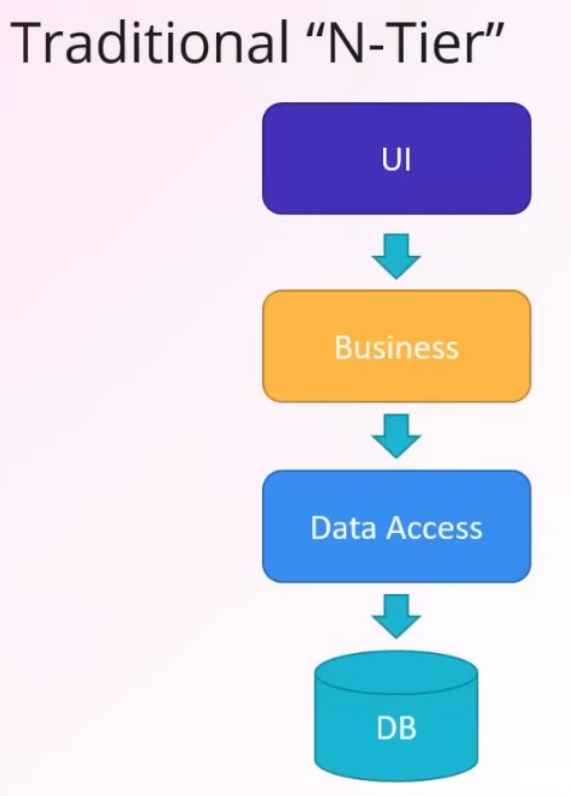
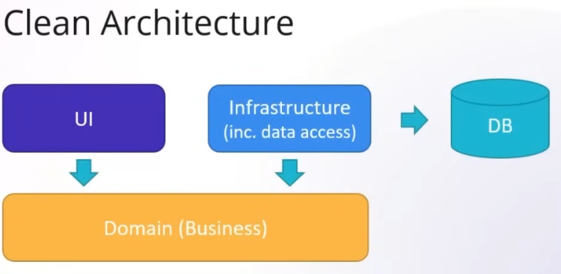

---
tags:
  - Conference
  - dotnet
  - ASP-NET
  - Architecture
  - Clean
---
[Previous Session](GitHub%20Copilot%20Tips%20for%20.NET%20Developers.md) - [Next Up](Build%20.NET%20MAUI%20Apps%20with%20DevOps.md) - [.NET Conf 2023 Parent Page](../README.md)

---
_Speaker: Steve Smith (ardalis) - Founder & Principal Architect, NimblePros_

[Link to vod](https://www.youtube.com/watch?v=yF9SwL0p0Y0)

>[!note]
>### Summary
>Clean Architecture is a more sophisticated take on the old n-tier architecture. Clean works well in conjunction with Domain-Driven Design. The main thing Clean does for you is that it inverses the dependency on the database. By having the Domain at the center which has interfaces which the Infrastructure can implement the dependency is not pointing at the database anymore. Clean might be more verbose but it's also providing you with the guardrails and security that you're not breaking things.

_There are two architecture talks this Conference, this one about Clean and [Vertical Slice Architecture: How Does it Compare to Clean Architecture](Vertical%20Slice%20Architecture%20How%20Does%20it%20Compare%20to%20Clean%20Architecture.md) talking about vertical slices. It might be well worth it to watch both to get sort of both perspectives._ 
# What is Clean Architecture?
Very closely related to onion architecture, hexagonal architecture, ports and adapters. 

The point is to have a domain-centric approach in the way you're organizing your dependencies. The opposite, before Clean you have the Database as the center. Which forces you to have a bunch of tradeoffs. Like trying to find seams in your application for testing purposes. Or change some of the dependencies. Clean puts an emphasis on minimizing the dependency on infrastructure. This comes with it's own set of tradeoffs. And Clean is obviously not a perfect architecture but it's a good fit for many options out there and it's definitely one that you should be aware exists since it has such a prevalence in the market-share. 
# Why would you use Clean Architecture?
If you're practicing Domain-Driven Design and want focus on the domain model, not the infrastructure. This architecture really enforces that way of thinking. And it's a way to protect that design philosophy from outside dependencies.

If you have complex business logic that requires and warrants a lot of testing. Since Clean provides such a high testability it's really easy to break down and test your business logic to ensure that what you're doing is correct.

Clean architecture helps you use the architecture itself to enforce polices of how the project should look, instead of just relying on your developers. People make mistakes, and this helps minimize this. Similar to how strong types helps people do the correct thing. In Clean if someone tries to bring in a dependency that they shouldn't the compiler will tell them that they can't do that - helping them make the correct choice.

# Two approaches to layered architecture
There's been multiple reasons for why you would want to break up your application into different logical layers. The most commonly traditional one is known as n-tier architecture. The problem n-tier got is that everything is transitively depending on the database. This can make it hard to write unit-tests for things above the database because you might have to deal with abstracting it away. 

Meanwhile a similar Clean architecture project will look like this. Important to note is that not all the arrows are pointing towards the database. Which means not all the layers are transitively dependent on the database. To make this inversion, you have abstractions/interfaces in the Domain Layer. These abstractions can then be implemented by the infrastructure layer. This makes it so that the Domain layer has no dependencies on UI or interface.

It's possible to ship successful software where you have all of these layers in one project in your solution. You just have different folders e.g. a Infrastructure folder and a UI folder. But there's no surefire way on compilation to ensure that there's no intermixing between the folders. You might be a good citizen and not do it, but you would have to manually check. Clean Architecture will give you the proper guard rails that you need.
# Template
Steve has a [template](https://www.nuget.org/packages/Ardalis.CleanArchitecture.Template) that helps you fire up a Clean Architecture Solution, this is downloadable from NuGet.

What's neat about having this is that you don't have to create all the projects yourself. The solution from the template is about 7 projects, 3 which are test projects. But you get away from all of that hassle. Saves you time and tedium.
# Clean Architecture Rules
There's three rules that makes up Clean Architecture.

1. Model all business rules and entities in the Core project. 
All the logic, and the data-access logic should be contained, it shouldn't be scattered about leaking into every place in the application. You want to have a central place that makes it easy to test.
2. All dependencies flow toward the Core project.
Nothing goes from Core to UI or Core to Infrastructure etc.
3. Inner projects define interfaces; outer projects implements them. 
This is how we're leverage the dependency inversion. 
# Core project
## What goes in the Core project?
**Interfaces**; you will have a bunch of interfaces in your Core project, that will allow you to have implementation in outer projects or even the Core project itself. Since everything depends inwards onto the Core project every other project will have access to these interfaces. Interfaces focuses on _what_ needs to happen, implementations focuses on _how_ it should happen. And _how_ is not part of the interface.

**Domain Model Types**; These are the things that will typically get persisted somehow. It includes..
_Entities_: anything with an identity.
_Value Object_: things that gets compared to one another based on their values. Are typically stored as properties inside our Entities.
_Aggregates_: Entities that are grouped together, that have some kind of relationship to belong together to a whole e.g. a purchase order with line items. These gets persisted as a whole unit, which means you get them together and update them together. For example you can't take a line item and update it's value cost without the aggregate knowing about it.

**Domain Services**: Typically an outlier, but here you can put logic that can't go into anything else. Usually it's services that need to orchestrate between different aggregates or entities. 

**Domain Exceptions**: Things that are domain specific, and are things that can go wrong within your domain. By having domain exceptions you save future you some headache by having these tailored exceptions for debugging. 

**Domain Events/Event Handlers**: You might be using events, that when something particular happens in your application something else ought to happen, or something else should know about this happening. Domain Events can tie into the improved telemetry in .NET 8, where you maybe send off an event for increasing a counter or something. They're a nice way to decouple your workflow. 

**Specifications**: A underused way to define queries. If you look at your code and there's just LINQ statements everywhere that tries to get objects, including certain rows, applying services. And this is everywhere there's big LINQ statements. Specifications is a way to pull this back into your domain layer where they're testable and maintainable in a central location. 

**Validators/Enums/Custom Guard Clauses**: Custom domain specific things for you.
# CQRS
Stands for Command / Query Responsibility Segregation. And this is an optional design addition that you can add to your application to further decouple things. And it has a various benefits that Steve didn't have time to go into. It sits between your Domain model and your UI. This is most commonly achieved by adding a project called "Use Cases" or sometimes "App Services" that the traffic goes through.

Some people might prefer to have a root level folder in their Use Cases folder with "Commands" and "Queries" to be very clear that they're doing CQRS, but this is preference. Steve and others prefer not to but he acknowledges that some people prefer to have it.
## What goes in the Use Cases project?
**Commands/Command Handlers**
**Queries/Query Handlers**
**DTOs** - that support your commands and queries.
**Behaviours**

In the Use Cases project there's basically the things we can do with our Domain types. In a Todo application, things like "Add Todo Item" might be a Use Case.

Steve demos a "Mark Todo Item Complete" command and handler. The handler calls into the Domain Layer to access a specification which retrieves a specific aggregate by id and returns it together with it's entities.
# What goes in the Infrastructure project?
**Repositories** - for persistence, can use any implementation for that like EF Core or Dapper etc. 
**Cached Repositories** - By having this abstraction going on you don't have to build in the caching into the services. You can just create a caching object that wraps around your repositories and caches wherever you need to. In the specification pattern Steve is using there's a boolean on specifications that you can flip to true to enable caching.
**DbContext Classes**
**API Clients** - for any external 3rd party API calls.
**File System Accessors**
**Azure Storage Accessors** - Other providers exist.
**Emailing Implementations/SMS Implementations** 
**System Clock**
**Other Services**
**Interfaces** - The only interfaces that should go here are ones that have dependencies on infrastructure, remember we don't want Core Project or the Use Case project to depend on infrastructure. Like if the interface itself returns something like an Azure Blob Item, we don't want that in our Core project because we will be bound to Azure. 

You don't need to use Repositories for your Queries. Many teams get that confused and they use repositories for everything, which pushes them to write complex LINQ queries. When you're doing a query you're not returning back your Domain model, you're just returning back some query results which means you can do whatever it is you need to do to get that data. You're not doing any logic on these typically, so it doesn't matter what you're doing. You're usually just going to present the data.
# What goes in the Web project
**API Endpoints**
**API Models**
**Filters**
**Model Binders**
**Tag Helpers**
**Razor Pages**
**Controllers**
**Views/ViewModels**
**Composition Root** - Where you wire all your services up to their interfaces. 
**Other Services/Interfaces** - once again only if it depends on it self and never inwards. E.g an interface for ViewModel, since ViewModels live here so does their interfaces.

Web project fully works with minimal API as well, no worry there. If you're using a use cases layer you can send off your commands and queries directly via MediatR (or any other Mediator library/pattern) here. If you're not using Use Cases you would interact directly with the Domain model layer from Web.

Endpoints should be very thin. There shouldn't really be a lot if any logic here.
# The Shared Kernel
[Shared Kernel](https://weeklydevtips.com/episodes/029-718a5d8f) is a Domain-Driven Design term is a way to share common Types across Solutions (.sln to be clear about terminology). These are typically referenced in the Core Project. The best way to distribute these are as NuGet Package.
## What goes in the Shared Kernel project
You should probably have your own for your company, and adjust things to your own needs. But these are the ones that Steve uses. Steve also got [this](https://www.nuget.org/packages/Ardalis.SharedKernel) as a NuGet starting of point.
**Base Entity**
**Base Value Object**
**Base Domain Event**
**Base Specification**
**Common Interfaces**
**Common Exceptions**
**Common Auth**
**Common Guards**
**Common Libraries**
**DI**
**Logging**
# Questions from stream
## Q: When would you use Clean vs Vertical Slice?
A: Steve prefers to work with Clean Architecture. But he does work in Vertical slices logically, like he does his work separated by slices, but the architecture that encapsulates it he prefers to use Clean. Clean provides you with guardrails that he likes. So he is shipping in slices but it's laid out in Clean.
## Q: Why do you focus on Specifications instead of CQRS?
(The question was asked before Steve went into CQRS to be fair.)
A: He does both, specifications is a way to keep LINQ from polluting the entire codebase. LINQ is great but you don't want it everywhere. This is especially true for when people are passing around `IQueryables`. This often leads to performance issues that's very hard to track down. With specifications you're in practice naming your LINQ queries that makes them easily to get an overview.