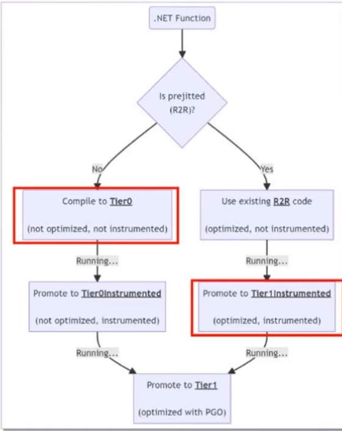

---
tags:
  - Conference
  - dotnet
---
[Previous Session](dotnet%20Configuration%20In%20Depth.md) - [Next Up](Build%20hybrid%20apps%20with%20.NET%20MAUI.md) - [.NET Conf 2023 Parent Page](README.md)

---
_Speaker: Andy Ayers - Principal Software Development Engineer, Microsoft_

Egor Bogatov (Senior Software Engineer, Microsoft) was meant to also be a part of this talk but he couldn't make it so it's all Andy.

[Link to vod](https://youtu.be/WrpYcGic9b8)

>[!note]+ Summary
>Dynamic PGO is enabled by default in .NET 8 and it should lead to a solid performance increase out of the box. Dynamic PGO will instrument your compiled methods and optimize the ones that are used heavily to be as efficient as possible, while not wasting time on methods that are not used as much.

This is probably be going over my head a little bit. But I am interested in the topic and I want to learn more so will try to convey what I can. 

[Performance Improvements in .NET 8, ASP.NET Core, and .NET MAUI](../Day%201/Performance%20Improvements%20in%20.NET%208,%20ASP.NET%20Core,%20and%20.NET%20MAUI.md) is a related talk about performance.
# .NET 8 is Fast
Each new version of .NET builds upon an already fast version of .NET so each version is only getting faster and more performant. There's been a lot of performance updates all across .NET from small to big changes, we're talking 1000's of changes. One of the big ones this change is Dynamic PGO. 
# What does Dynamic PGO bring?
By just changing our runtime to .NET 8.0 from 7.0 we gain about 15% better performance. They don't like saying a number because so many things go into it, but 15% is the number that gets thrown about. 
# Background
PGO stands for Profile Guided Optimization. And it's a compiler technique that uses profiling data to guide it's optimization decisions.

Dynamic PGO gives you the benefits of PGO automatically. It works completely in-process; no special build, deployment changes, configuration tweaks need to be applied. Dynamic PGO leverages tiered compilation, which was introduced in .NET Core 3. Tiered compilation is the concept that the compiler has different levels, or tiers, of compilation optimization. A Tier0 (_T0_) compilation is unoptimized but it was fast to compiled. And a Tier 1 (_T1_) compilation has had all the optimization the compiler can throw at it. With Dynamic PGO the runtime behavior of methods is instrumented, and this instrumentation is then guided to create T1 methods that are as optimized as possible. This concept is not .NET specific and is widely used in Java ("HotSpot") and in JavaScript ("Trace JITs"). 
# Optimizations
## Guarded Devirtualization (GDV)
Many virtual and interface calls are what's known as "monomorphic" meaning that behind an interface there is only one class. Interfaces and classes are coupled 1-to-1. Virtual calls or interface calls are less performant than calling on the implementation directly. 

Even when classes are "polymorphic" there may be a predominant class that's implemented. What GDV does is that it implements tests that checks for these types, it guards. If the test succeeds it knows which method should be called since it knows what type it is. This is the devirtualization. The JIT will also try to inline the method at this point. 

The JIT will do further optimizations, like if the method is on a value class the JIT will inline the unboxing stub and the method. If the class is a boxed value type, the JIT will try attempt to optimize away the box.

If the test fails, then you can just do the normal virtual / interface call. Meaning that if the JIT is correct then you see performance benefits, but if it's wrong with it's assumption then you don't lose out on anything.

With .NET 8 GDV can handle som delegate invokes as well. 
## GDV Enabled Loop Cloning
If you got a virtual/interface/delegate call site inside a loop, then the guard checks itself may be loop invariant. Meaning that within the loop you're only ever going to call the same implementation. This means that we can break out the guard to outside the loop, and clone the loop. Giving us one loop where we have the JIT guesses the implementation, and one that uses the virtualization/interface/delegate call.

This helps to deabstract patterns known as "zero cost abstraction", where you write your code very generically but it doesn't run generically.
# Instrumentation
Even if you're using Ready To Run (R2R) which prejits your code to give it some performance optimizations out of the box, it can still get better. The JIT didn't know what paths were hotpaths in the program, or which paths gets called more than others. It did it best but this could stil be improved. Which is why it goes to T1 Instrumented, where it adds in the instrumentation to R2R code to make it into proper T1 code.

## Costs
Instrumentation is not free, you're in there messing and tracking things that weren't tracked before. So to counteract this they added optimizations in .NET 8. For example the JIT might completely bypass instrumenting a method if there's nothing to learn, say if you have a method that just returns 3. So instead of wasting resources it just bypasses that.
# Enabling
Just upgrade to .NET 8. That's all there is to it. You could review your configuration settings to ensure you're not disabling any of `TiredCompilation`, `ReadyToRun`, `QuickJitForLoops`, `OnStackReplacement`. But these configs are not typical, it's mostly if you opted into PGO in .NET 6 or 7. 
# PGO & Native AOT
Native AOT supports static PGO. With the way AOT works they can get some optimizations even without PGO.