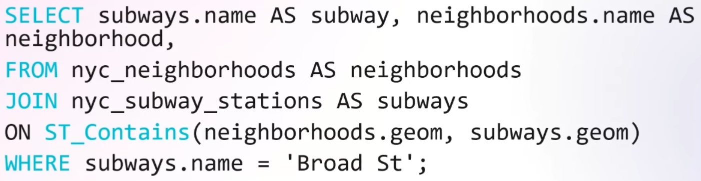

---
tags:
  - Conference
  - dotnet
  - EFCore
  - MAUI
  - NuGet
  - Geometry
---
[Previous Session](Understanding%20Role-Based%20Access%20Control%20with%20ASP.NET%20Web%20APIs.md) - [Next Up](Building%20beautiful%20Blazor%20apps%20with%20Tailwind%20CSS.md) - [.NET Conf 2023 Parent Page](../README.md)

---
_Speaker: Giorgi Dalakishvili - Tech Lead, Space International_
[Link to vod](https://www.youtube.com/watch?v=lBFlNjRbMsk)

>[!note]
>### Summary
>With spatial data we're talking about 2D geometric data. All modern relational database providers support storing this kind of data. We can work with it in .NET applications by using the `NetTopologySuite` NuGet package. This will give us access to the data types and the methods needed to work on Spatial data. Getting it to work with EF Core is as simple as putting it into the configuration in EF Core setup. 

_Nothing here is really exclusive to MAUI except for the  specifics of the demos._
# Spatial Database
Applications that use spatial data include Google Maps, Taxi Apps, or apps for ordering food delivery. 

We use these to store and manipulate spatial objects. Spatial datatypes include things like point, line, polygon etc. These databases come with functions that allow us to query for spatial properties. Like querying on the location of a point, or the length of a line. They also allow us to query on spatial relationships like checking if two objects intersects or if one is fully contained inside another and so on.

Spatial data is used commonly to compute lengths, distances, and areas. They're used to find the nearest points to a given point and check for intersections etc. Spatial data is also used to find clusters and patterns in a dataset.

All the major relational database providers out there are built upon technology that allow for spatial data. 
# Basic Types
## Point
This represents a single location, with X-coordinate, and Y-coordinate.
## Line
Lines are two points connected. These can be used to represent things like rivers, and streets.
## Polygon
Polygons represent an area. You got an outer boundary that's represented by a ring. Polygons got functions to get the area and also the perimeter of the ring.
## Multipolygon
You can define multiple polygons together. These can be fully inside one another. Like a donut.
# Query samples
You can do things like this. Where `ST_Area` is a built in function in the database provider. Note that the name can be a little bit different in the specific database provider but it's mostly the same. For example in SQL Server the function is called [`STArea`](https://learn.microsoft.com/en-us/sql/t-sql/spatial-geography/starea-geography-data-type?view=sql-server-ver16). This will take the specified polygon from the WHERE statement and return it's calculated area.  


## Spatial Relations
You can call things like `ST_Intersects` to see if two shapes intersect with each other. Or functions like `ST_DWithin` which will tell you if geometries are within a given distance. This helps you find items within X meters of a given location.
## Spatial Joins
You can use spatial relations functions when joining tables together. Like this example which joins the neighbourhoods and subways tables together. But it's using the `ST_Contains` function to check which neighbourhood contains the subway station. 

# Spatial Indexes
Databases that support spatial data also support spatial indices which helps speed up spatial queries.
# Spatial Data in .NET
To work with spatial data in .NET we use libraries to help with our work. Primarily `NetTopologySuite`, which allows to map Spatial types into .NET classes. Topology Suite got classes that represent all the basic types and functions mentioned above.
## Spatial Data in EF Core
In the configuration of our database connection we tell the database that we want to use Topology Suite
```Csharp
optionsbuilder.UseNpgsql(
	"Host=localhost;Database=nyc;Username=postgres;Password=***",
	x => x.UseNetTopologySuite()
);
```
## Spatial Data in ASP.NET
`GeoJSON` is the format used to encode geographic structures. It's baked into Topology Suite, however you have to register with your Json options in your service builder in order for it to work
```Csharp
builder.Services.AddJsonOptions(options => 
{
	options.JsonSerializerOptions.Converters.Add(
		new NetTopologySuite.IO.Converters.GeoJsonConverterFactory());
});
```

This will help us serialize and deserialize our points, polygons etc. into JSON. And we can use return spatial data from our controllers or receive spatial data as parameters.
## Spatial Data in MAUI - Demo
The use-case exemplified in this demo is having a [Map control](https://learn.microsoft.com/en-us/dotnet/maui/user-interface/controls/map?view=net-maui-8.0) that has a map of New York City. And having pickers for picking a specific neighbourhood in NYC. When you pick a neighbourhood the app does a backend call to retrieve the name and the geometry. The geometry comes as a `MultiPolygon`. The app can then go through the geometry's coordinates and add them to a Polygon. Which can then be added to the Map control. 

The app also needs to have the geo Json converter as previous section.

His second example is taking a user's click on the map, getting the X and Y coordinates (longitude and latitude). Drawing a circle around the click with a distance that's settable by the user. These three values, X; Y; radius of circle, gets sent up the backend API. There it's really mostly combining all the things mentioned here, he is using the Spatial functions that come with the topology suite to make a db query directly with EF Core in order to get Subway stations that's within the radius of the point.

```Csharp
var subwaysInRange = await context.NycSubwayStations
	.Where(station => station.Location.IsWithinDistance(center, radius))
	.Select(station => new SubwayStation
	{
		// Mapping over properties to new subwaystation
		// ...

		Distance = station.Location.Distance(center)
	})
	.OrderBy(station => station.Distance)
	.ToListAsync();
```

As we see above the `IsWithinDistance` method is leveraged to make the query simple. And then in the mapping I hid the irrelevant ones but pointed out here that he also leverages the Distance spatial function which tells us the distance from the station to the center aka the point the user clicked. 

These locations we send back can then be converted to Pins and shown on the map. In the app he is using `ObservableProperties` in order to automatically show changes in the UI. When the property is changed so is the UI. The `ObservableProperty` is put on the list of stations that are within the circle, and the Pins themselves are inside an `ObservableCollection<Pin>`