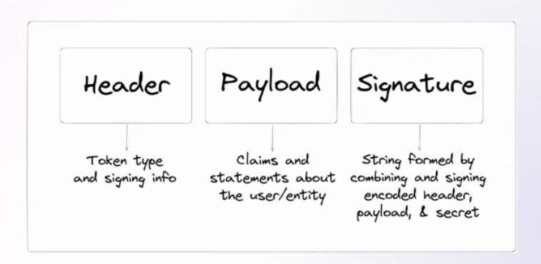

---
tags:
  - Conference
  - dotnet
  - Authentication
  - Security
---
[Previous Session](Vertical%20Slice%20Architecture%20How%20Does%20it%20Compare%20to%20Clean%20Architecture.md) - [Next Up](Spatial%20Data%20with%20Entity%20Framework%20Core%20and%20.NET%20MAUI.md) - [.NET Conf 2023 Parent Page](../README.md)

---
_Speaker: Aditya Oberai - Developer Advocate, Appwrite_

[Link to vod](https://www.youtube.com/watch?v=r8fVjPqpVkA)

>[!note]
>### Summary
>Role-Based Access Control got benefits such as making it easy to give new people access and also making sure that people have no more access than they absolutely need. If the amount of roles in a system grows to large it can become a large problem and add substantial maintenance overhead however. There are alternatives out there like attribute based access control and policy based access control.
>
>Roles can be defined in a JWT as claims and then read by the Authorization Middleware to limit access to resources.

> [!warning]
> The stream/video is really struggling with some audio issues. So sometimes it's a bit hard to catch what was said, but it should be mostly okay.
# What is Role-Based Access Control?
It's a security model which restricts the access to a system based on the _role_ assigned to users within an organization. Specific roles have access to specific resources and you grant a user access by giving them the role. 

An example of RBAC is admin control, where you have parts of a website that only the admin can access. Admin is a role that's more exclusive than regular users. And they're given more access based on this. 
# Pros
**Principle of Least privilege**, allows organizations to give users the absolute minimal access they need to do whatever it is they need to do. Which minimizes the risk for accidental or intentional missuse of permissions.

**Simplified Permissions Management**. It allows management of access simply by assigning or removing roles to a user. As long as there is a role match between resource and user. This helps streamlining the access process.

**Consistency In Access Control**; Since all the users within a role have the same access, you can be sure that people have the access they need simply by giving them the correct role. 

Since you can have distinct roles it allows for **Easier Auditing**, which helps ensuring you're inline with regulatory compliances. As well as it helps deviations from the norm. 

Because users can easily get assigned a role instead of access to specific systems it's faster for the organization to onboard people. And you're not hitting delays due to access issues. 

It's easier keep a segregation between duties in an organization by having clear defined roles within the system.

Since RBAC is a system to limit access to resources it's a system that allows you to have improved privacy and security when done properly.
# Cons
Roles can take a while to setup the first time. The larger your amount of users are the longer it's going to take. Assuming that you have more roles than just a few for all of these users. This means that you have to properly plan and properly understand the hierarchy of the users before you undertake this. 

There's a risk that as you grow so does the amount of roles, and they just keep growing until you have an unmanageable amount of roles in your system.

RBAC is not by nature dynamic, it's not something you roll with on the spot. Since if you want to be highly dynamic you need to create a new role.

For large RBAC systems there's a significant maintenance overhead. Ensuring people are in the proper roles. That you don't have people still in roles with too much access. Ensuring you don't have vulnerabilities in your RBAC system. And that the roles still match the needs.

RBAC doesn't have the same type of granular access control as policy based control or attribute based control.

It goes without saying but RBAC only works if you have accurate role definitions. If the roles are not accurate the entire system doesn't work.

# JSON Web Tokens
## What are they?
Open standard that defines a compact and self-contained way for securely transmitting information between parties as a JSON object. 

A token is stateless, meaning the server doesn't have to store anything. This allows the system to be scalable and suitable for distributed systems. Since you're not increasing the resource cost by creating more tokens. 
## 3 parts
Every token has three parts, Header, Payload, Signature.

The header says which algorithm was used to sign the token, such as HMAC, SHA, or RSA. 
Payload contains the claims about the user, such as email, id etc. 
The third part is the signature, it's created by taking the base 64 header, the base 64 payload, and a secret that's only known to the server; combining these with the signing algorithm specified in the header.
## How servers validate
1. The server decodes the JWT to extract the header and payload. 
2. Since the server has the secret it can recreate the signature and ensure they're the same.
3. The server checks the expiration date to ensure it's a valid, active token.
4. The server may perform additional checks that they want to do. Such as verifying the token issuer and audience etc.
# Implementing RBAC with JWT
Roles are set by using claims. The claims are then checked by the Authorization middleware. To apply the roles you add the `[Authorize(Roles = "<role-to-check>"]` attribute to actions/controllers. To make this work with Minimal APIs you must create a policy that define the roles. 

You're not locked to using ASP.NET Core Identity to make this work. 

The question is though if you're not using ASP.NET Identity, are you using another identity service? Since rolling your own probably is not what you want to do. And if that other service doesn't have role support, maybe rethink your idea.