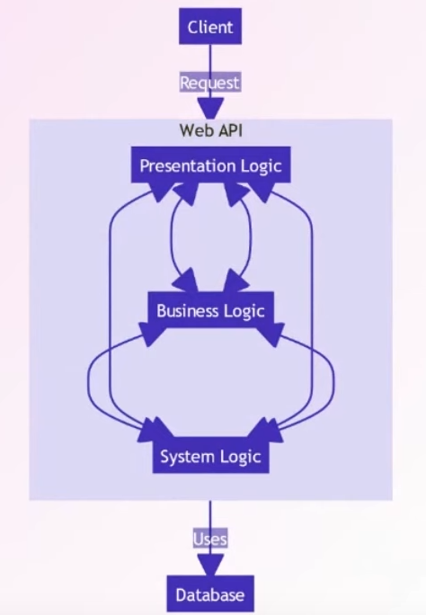
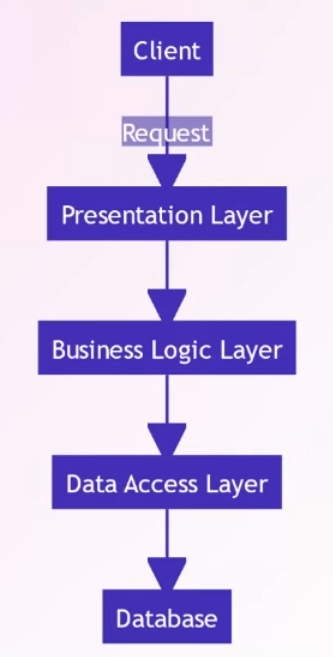

---
tags:
  - Conference
  - dotnet
  - Architecture
aliases:
  - "Vertical Slice Architecture: How Does it Compare to Clean Architecture"
---
[Previous Session](What's%20New%20in%20NuGet%20for%20.NET%208.md) - [Next Up](Understanding%20Role-Based%20Access%20Control%20with%20ASP.NET%20Web%20APIs.md) - [.NET Conf 2023 Parent Page](README.md)

---
_Speaker: Luke Parker - Software Engineer, SSW_
[Link to vod](https://www.youtube.com/watch?v=T-EwN9UqRwE)

>[!note]+ Summary
>Vertical Slices cut the codebase down at a feature level instead of a technical level which Clean does. It allows you to have decoupled features that doesn't affect each other when they get changed. Since code that is executed together is next to each other in the codebase it's easy to find all the places where a request touch on it's way through the application. There will be shared code even in a vertical application and it's risky to place code in the shared space since that's a dependency outside the slice. Knowing what to put in the shared space is key to not have a spaghetti application.

_There are two architecture talks this Conference, this one about Vertical Slices and [Clean Architecture with ASP.NET Core 8](Clean%20Architecture%20with%20ASP.NET%20Core%208.md) talking about Clean. It might be well worth it to watch both to get sort of both perspectives._ 

>[!warning]+ 
>His screen is frozen in the vod right when he is showing the code. At least as of 2023-11-18. So no real idea what's going on there.
# No Architecture
In a web API there's typically three kinds of things going on. Presentation logic, business logic, and system logic - EF Core and the like. No architecture is what we call spaghetti architecture and it's not what you want for an application with any kind of size.

The problem here is that it's easy for things to get very intertwined. And things leak out of their responsibilities into other ones. Business logic in the presentation logic area etc.

It might be good to get started since you just start writing code, the start up time for the developers is very short. However when the project grows so also does the problems. It gets harder to develop new features because everything is entangled. It also makes it difficult for multiple teams to work on the project because each change breaks things for the others. It also becomes difficult to test your application. Basically don't do this.
# n-Tier Architecture
If we instead break out the technical concerns to their own layers, where they depend on each other in a downwards direction towards the database. We can represent this in a solution by using different projects for each layer. 

It's an intuitive way to build a project. And it's also decent for developers to get started, since it's just a simple abstraction of what we might've had before. We separate things a bit more but it's still reasonably fast to set up and get started.

n-Tier suffers from the same issues a spaghetti solution would (just not as strongly). You will feel the same pain when the application gets larger. And it becomes a problem when everything depends on the data access layer, you can't move on before that's in place.
# Clean Architecture
Clean architecture breaks out the data access, so that the business logic and the presentation is no longer dependent on it. At the core you instead have the domain, which can be any type of data-models. The Infrastructure layer, which is what we call the data access in Clean, will implement interfaces that the application layer declares and such the infrastructure layer is interchangeable.

Clean is highly abstracted which helps for larger systems. It's also very resilient for technology changes, allowing you to swap out parts that's not core to the actual application. This makes clean architecture projects also very testable. Clean architecture doesn't suffer the same inertia or becomes slower to develop new features when the project grows. Due to the high level of abstraction it's also easy for multiple teams to work on the codebase.

There's a higher barrier to entry due there being a lot of theory involved with Clean Architectures, it requires your team to know what they're doing and they need to be disciplined to not break the principles. Many people complain that there is a lot of code to write for a simple feature. This might be a symptom of something else. If all your endpoints are that simple you might've overengineered your system and you might've applied the wrong architecture, and something like n-tier might suit you better. Something that's perfectly fine for simpler logic applications. 
# Vertical Architecture
## How does a request get processed in Clean?
Clean is what's known as a layered architecture. You separate things based on a technical concern. This leads to your code for a single request being scattered across multiple projects. Since each step is separated from the one before.
## Proximity Principle
The proximity principle is pretty much at the core of vertical slices architecture. 
> Code that is changed together should live together.

Meaning that files which used to be sharded across projects now gets put together into a folder and they're isolated from the rest of the solution. Instead of slicing our architecture horizontally by technical concerns, we slice the application vertically by feature concerns.  

---
There's little to no abstraction in vertical slice architecture, it's just there in it's folder. No abstraction means there's also low barrier to entry. Since you can slowly migrate each feature to a new technology it becomes somewhat resilient to changes to. The level of testability is determined by the slice, it can be very simple. Or someone can do something cursed in their slice that makes it hard to test. Vertical slices got shared code that's interacted with by multiple slices and then there are the slices themselves which are isolated. Within a slice a team won't affect any other teams. Which also mean that a new feature doesn't affect any old features. 

When the application becomes large and complicated you are going to inadvertently have some kind of communication between slices. And when that happens it requires the solution architects to be really specific with how and why and where this happens. You will most likely have to implement some kind of mediator or service bus pattern for this too. It's also hard to decide what gets to be shared code and what is feature code. You want to minimize what's shared code since that introduces a risk of breaking things. But you also don't want to be replicating code more than you have to. Each feature could in theory be written in different ways with different philosophies since the architecture doesn't enforce anything. Which could lead to a cognitive load and slow down development when you move between features.