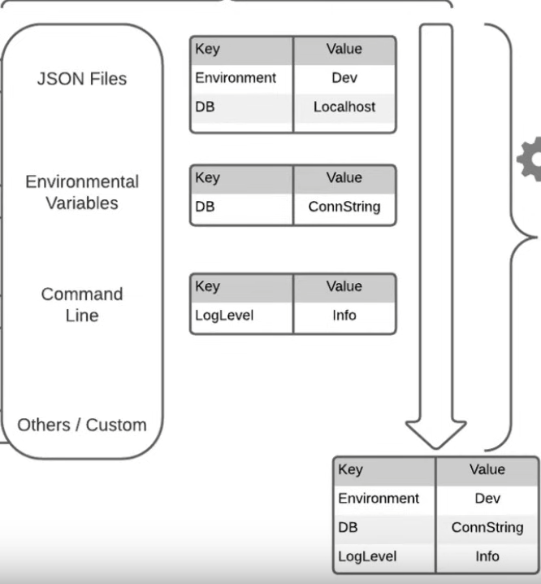
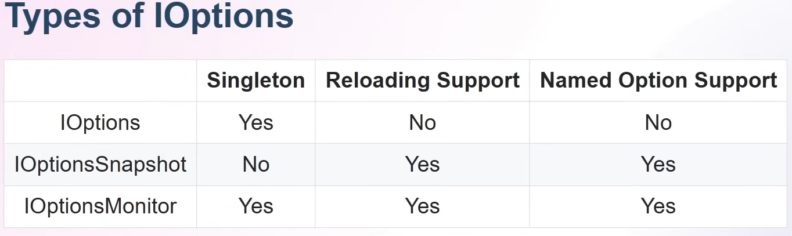

---
tags:
  - Conference
  - dotnet
  - Configuration
aliases:
  - .NET Configuration In Depth
---
[Previous Session - End of Day 2](../Day%202/Migrating%20.NET%20applications%20to%20Azure.md) - [Next Up](Dynamic%20PGO.md) - [.NET Conf 2023 Parent Page](README.md)

---
_Speaker: Chris Ayers - Senior Customer Engineer, Microsoft_
[Link to vod](https://www.youtube.com/watch?v=aOXaBZFB0-0) - [Resource](https://learn.microsoft.com/en-us/dotnet/core/extensions/configuration)

>[!note]+ Summary
>You have so much freedom when it comes to configuration, and the best part is that it all mostly work the same way, it gets hooked into our existing configuration. The best practices is to bind your settings you're going to be using into a class. Then register this class with a flavour of the options interface so it can be injected. This way you can provide your configuration with data annotations and have better control of the access to the properties. The properties becomes easier to handle compared to the raw strings.

# What is configuration?
Might be values as retry times; might be feature flags; might be secrets like connection-strings or app registrations.

Historically a lot of configuration got baked into at compile time. But now a days you are able to apply config at runtime. 
## Orders matter
These days you define your configuration via JSON files, via environmental variables, via the CLI or other sources. These then get put through the provider into a configuration builder. But the order of the configuration sources matter. Later sources will overwrite earlier ones if duplicate keys are found. In the example here the DB key gets overwritten.


This gets flattened, out, meaning the Json supports nesting but it also gets flattened out in the end. 
# Out of the box
A default `dotnet new` console applications comes with no configuration. 

A default ASP.NET application comes with Json through `appsettings.json` or `appsettings.{Environment}.json`. You get Environmental variables, command line variables, and user secrets. 

There are a bunch of File based configuration providers, not only JSON/XML there are also INI and Key-per-file.

We can also use Azure Key Vault and Azure App Config.
## Adding to console.
Adding configuration to a default console app is simple, just add the configuration NuGet. Then use the configuration builder to add in your Json files or environmental builders. 
# Environmental Variables
These are commonly used for docker containers or Kubernetes where that's the main way to drive into the application from the outside.
# User Secrets
[Resource](https://learn.microsoft.com/en-us/aspnet/core/security/app-secrets?view=aspnetcore-8.0&tabs=windows)
Are highly recommended to use for development purposes. When you set these up they will add a guid to the csproj, but no secrets will be checked into the file system. When you set this it's stored to your hard drive but in your app-data, outside of your dev environment. 
# Nested
Nested variables are accessed in code via the colon ' :  eg. `parent:child`
If you can't use a colon, due to filesystem naming, or colon being a delimiter in shells, you use a double underscore eg. `parent__child`.
# Mapping
You can define mappings that work as shorthands for your command line work. You define these as a `Dictionary<string, string>` and then pass them into the configuration builder when you register command line. This will allow you to set up things like accessing nested variables with a short hand, or maybe typing "env" instead of "environment". Convenient things basically. 

In code we still use the long hand format, this just affects interactions on command line.
# Azure KeyVault
Azure KeyVault comes with a bunch of support packages that makes it easy to use. 
**Example:** We can have a name for te KeyVault stored in a Json, then with our configuration we get that name, create a URI that points to a KeyVault, which is a string with a name that's variable. Then we just add this to our configuration with `AddAzureKeyVault(new Uri(keyVaultUri)...` and 
an instance of azure credentials.

Secrets from a KeyVault gets accessed the exact same way as any other configuration. Since they've just been added in.
# Binding to class
You can create a class, which has the same string properties as the properties on our configuration object, and then we can bind the configuration into the class. 

```Csharp
// This works if you have an instance of the options
var myOptions = new MyOptions();
configuration.GetSection("sect")
	.Bind(myOptions);
	
// If you don't have an instance you can do this
var myOptions = configuration.GetSection("sect")
	.Get<MyOptions>();
```
# The Options Pattern
Follows the Interface Segregation Principle (ISP), this is going to let us not rely so heavily on the configuration directly but pull them apart and rely on the classes we've bound to instead.
## An options class
An options class must be non-abstract, with a public parameter less constructors. It must contain public read-write properties to bind. It won't bind to fields.


`IOptions` doesn't support reloading, meaning if you update for example your KeyVault at runtime it won't update to account for that.

## IOptions, IOptionsMonitor, IOptionsSnapshot
What you do is you register a class you want to bind into, like before, with the configuration engine. So that any time you ask for the options interface with that type you get what you've registered.
`builder.Services.Configure<MyClass>(builder.Configuration.GetSection("section"));"`

There's a difference, `IOptions` & `IOptionsSnapshot` get accessed via `.Value` while `IOptionsMonitor` gets accessed via `.CurrentValue`.
# Azure App Configuration
Allows you to have a centralized source of truth. It works similar to the others, you have a NuGet package that exposes the APIs you need. You then connect into the app config and tell it to refresh. Now refreshing makes it track the values, and if you have a lot of values this can become resource expensive. Instead we use a sentinel, and it only tracks if the sentinel has been updated. And if the sentinel gets updated then it refreshes all the other values too.
# Validation
A common thing is to have a class you bind into, and have requirements on that class, like length or required etc. Before this used to let you start the application and then blow up when a request came through and the application checked it's own validation. Now however it won't even let you start the application if your settings are not matching the validation. And it will tell you which settings are wrong.

Use `ValidateDataAnnotations()` when you bind into the class configuration. You can also add additional validations right there. and also add `ValidateOnStart` which will run this at start.

## Post Configure
You can run updates on properties of the configuration after it's been validated to be mostly good. If it passes your strict validation rules you can then do other checks and update it to fit.
It's clearer with an example. 

```Csharp
builder.Services.PostConfigure<MyUrlSettings>(settings =>

	 // make sure url scheme is HTTPS
	 if(!settings.Url?.StartsWith("http://") ?? false)
	 {
		 settings.Url = settings.Url.Replace("http://", "https://")
	 }
 )
```

This lets us update the faulty schema into the one we want, after all the other validation that's harder to fix has been validated.